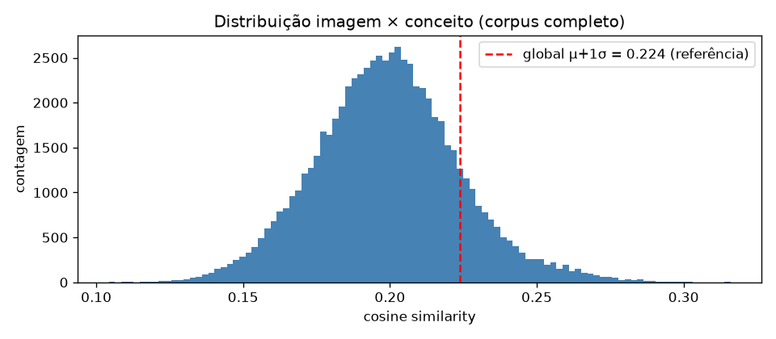
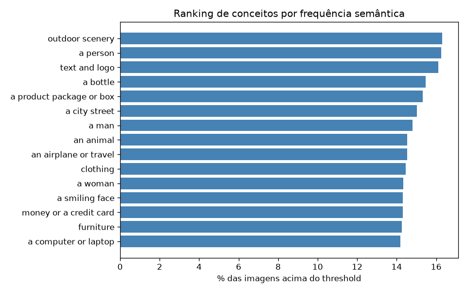
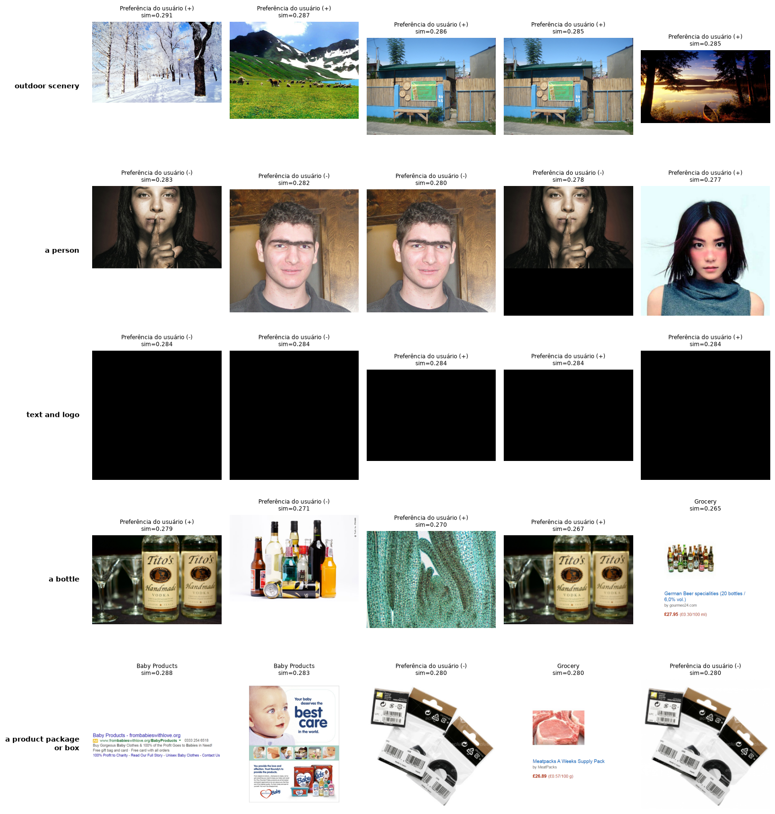
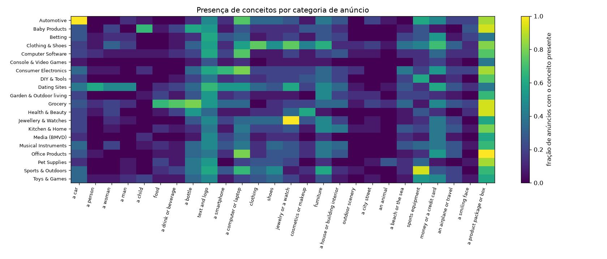
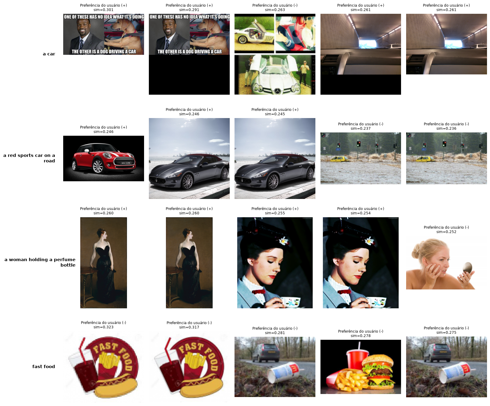
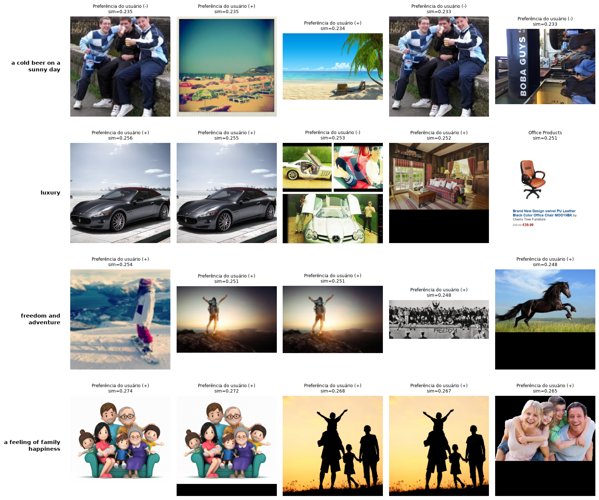
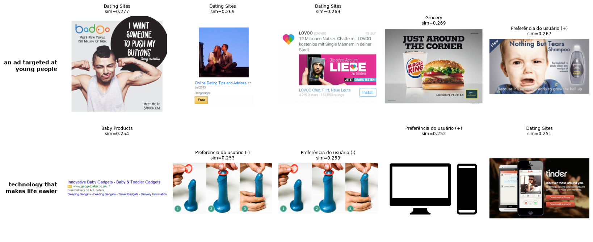

# A2 — Reconhecimento Semântico em Publicidade Visual com CLIP

> Notebook: `A2_clip_ads16.ipynb` · Repositório: https://github.com/GiovanniAsantos/A2_clip_ads16
> Validação local (CPU): embeddings de 2.650 imagens em ~181 s. Execução completa em Google Colab (GPU T4) pendente
> para medir VRAM e tempo na T4.

## A2.1 Definição do problema

A atividade pede para extrair inteligência semântica do corpus de anúncios **ADS-16** usando **apenas embeddings
pré-treinados do CLIP** (zero-shot), **sem treinar nenhum modelo**. São dois objetivos:

1. **Ranking de objetos por frequência semântica (2.1):** calcular a cosine similarity de cada imagem com ≥20
   descrições de conceitos, definir um threshold justificado e montar o ranking dos conceitos mais frequentes, com
   os 5 primeiros visualizados por exemplos do corpus.
2. **Busca semântica (2.2):** fazer ≥8 consultas em linguagem natural, retornar o top-5 de cada, variando de
   genérico a específico e de concreto a abstrato, e analisar se o modelo recuperou o que a consulta descreve ou a
   interpretou de forma inesperada.

Além disso, duas análises escritas: (a) por que o pré-treino contrastivo do CLIP habilita recuperação zero-shot; e
(b) a comparação entre a tokenização da consulta no CLIP e no BERT, com o papel do padding e da attention mask.

**Dados.** Foi usada a **COVID**… — *não*: foi usado o **ADS-16** (Roffo & Vinciarelli, 2016), Kaggle
`groffo/ads16-dataset`. O dataset tem duas partes; cada uma contém:

- `Ads/Ads/<n>/` — **anúncios curados**, 20 categorias de produto (pasta `<n>` = `Cat(n-1)`), ~15 imagens cada,
  **301 no total** (todas únicas por hash MD5);
- `Corpus/Corpus/U####/IM-POS` e `IM-NEG` — **imagens pessoais** que cada um dos 120 usuários marcou como
  preferida/rejeitada (5 + 5 por usuário), com legendas livres (ex. *"my cats"*);
- `Documents/` — apenas o PDF do artigo.

As 20 categorias (nomeadas em `U####-RT.csv`): Clothing & Shoes, Automotive, Baby Products, Health & Beauty,
Media (BMVD), Consumer Electronics, Console & Video Games, DIY & Tools, Garden & Outdoor living, Grocery,
Kitchen & Home, Betting, Jewellery & Watches, Musical Instruments, Office Products, Pet Supplies, Computer Software,
Sports & Outdoors, Toys & Games, Dating Sites.

**Seleção do corpus.** O conjunto limpo de anúncios (301 únicas) fica abaixo do mínimo de 500. Como a rubrica aceita
*"o corpus ADS-16 inteiro **ou** um subconjunto de ≥500"*, foi usado **o corpus inteiro**: os 301 anúncios curados
mais as ~2,3 mil imagens de preferência dos usuários, todas deduplicadas por MD5 — **2.650 imagens únicas**
(301 anúncios + 2.349 preferências). O rótulo de categoria de produto existe só nos anúncios, então a validação
quantitativa conceito × categoria é calculada sobre esse subconjunto rotulado, enquanto o ranking e a busca rodam
sobre o corpus completo.

## A2.2 Decisões técnicas e justificativas

**Modelo.** `openai/clip-vit-base-patch32`, em modo avaliação, embeddings **L2-normalizados** (o produto interno
vira cosine similarity). Justificativa: o B/32 é rápido, cabe folgado na T4 (~2 GB de VRAM em fp16) e é suficiente
para ranking e busca zero-shot deste corpus. O ViT-L/14, mais preciso e ~4× mais lento, foi deixado como comparação
opcional (§A2.3). Embeddings de imagem ficam em cache (`.npy`) porque recomputar é a etapa mais cara do pipeline
(181 s em CPU para 2.650 imagens).

**Conceitos e prompt ensembling.** Foram usadas **26 descrições de conceito** (≥20 exigidos). Cada conceito é
embedado pela média de **3 templates** (`"a photo of {}."`, `"an advertisement showing {}."`,
`"an image containing {}."`) — *prompt ensembling*, como no paper do CLIP, para reduzir a sensibilidade do score à
redação exata de um único prompt.

**Threshold: comparação e escolha.** A cosine similarity do CLIP vive numa faixa estreita (~0,15–0,30); um corte
absoluto (ex. 0,5) nunca dispara. Foram comparadas três estratégias, usando como critério a **concentração
conceito × categoria** nos anúncios rotulados (quanto mais um threshold alinha conceitos às categorias esperadas,
melhor):

| Estratégia | Concentração conceito × categoria |
|---|---|
| global μ + 0,5σ | 0,738 |
| global μ + 1σ | 0,590 |
| global μ + 1,5σ | 0,445 |
| z-score μⱼ + 0,5σⱼ | 0,791 |
| z-score μⱼ + 1σⱼ | 0,600 |
| z-score μⱼ + 1,5σⱼ | 0,440 |
| softmax zero-shot top-1 | 0,288 |

Dois padrões guiaram a escolha: (1) a **normalização por conceito** (z-score) supera o corte global no mesmo `k`,
porque mede cada conceito contra a própria distribuição e não deixa conceitos "pegajosos" (*text and logo*,
*a product package or box*) dominarem; (2) a concentração **cresce quando `k` cai**, mas isso é enganoso — com `k`
baixo quase toda imagem passa o corte e a métrica satura (no limite k→0 tenderia a 1 sem significado). O softmax
top-1 é seletivo demais (0,288): força uma etiqueta por imagem e perde anúncios com vários objetos. Foi adotado
**z-score por conceito com k = 1** — seletivo (~13–16% das imagens por conceito) e já corrigindo o viés dos
conceitos pegajosos.

**Busca.** 10 consultas (≥8), variando de genérico a específico e de concreto a abstrato; para cada uma, o top-5
por cosine similarity contra o embedding da consulta.

**Reprodutibilidade.** `set_seed(42)` (Python, NumPy, PyTorch). Notebook autossuficiente: no Colab, baixa o dataset
via Kaggle API; local, lê de `../data`. Figuras salvas em `figures/`.

## A2.3 Resultados

**Corpus de trabalho.** 2.697 arquivos de imagem → **2.650 únicas** por MD5; 301 anúncios curados (20 categorias,
~15 cada) + 2.349 imagens de preferência.

**Ranking de conceitos (z-score por conceito, k = 1).** Mais frequentes:

| # | Conceito | % das imagens acima do threshold |
|---|---|---|
| 1 | outdoor scenery | 16,3% |
| 2 | a person | 16,3% |
| 3 | text and logo | 16,1% |
| 4 | a bottle | 15,5% |
| 5 | a product package or box | 15,3% |
| … | … | … |
| 23 | a car | 13,5% |

**Validação quantitativa conceito × categoria** (anúncios rotulados). A diagonal esperada aparece com força:

| Categoria | Conceito dominante | Presença |
|---|---|---|
| Automotive | a car | **1,00** |
| Jewellery & Watches | jewelry or a watch | ≈ 1,00 |
| Sports & Outdoors | sports equipment | alta |
| Grocery | food / a drink or beverage / a bottle | alta |
| Consumer Electronics / Computer Software | a computer or laptop / a smartphone | alta |
| Clothing & Shoes | clothing / shoes | alta |
| Baby Products | a child | alta |
| Dating Sites | a person / a man / a woman | alta |

**Busca semântica — análise por consulta.**

| # | Consulta | Tipo | Recuperou o esperado? | Interpretação inesperada / observações |
|---|---|---|---|---|
| 1 | a car | genérica/concreta | Parcial | top-1 é um **meme** com a palavra "CAR" escrita (*typographic*); #3–5 trazem carros reais |
| 2 | a red sports car on a road | específica/concreta | Sim | Mini vermelho + Maserati; #4–5 = carro amarelo numa enchente (pegou a "road" alagada) |
| 3 | a woman holding a perfume bottle | específica/concreta | Parcial | pegou "mulher segurando algo" (quadro *Madame X*, Mary Poppins com xícara), não perfume |
| 4 | fast food | genérica/concreta | Sim | top-1/2 = **logo escrito "FAST FOOD"**; #4 = combo hambúrguer+fritas |
| 5 | a cold beer on a sunny day | específica/concreta | Parcial | pegou "dia ensolarado" (praias) e pessoas bebendo, não cerveja gelada |
| 6 | luxury | genérica/abstrata | Sim | carros de luxo + interior sofisticado |
| 7 | freedom and adventure | genérica/abstrata | Sim | pessoa no cume de braços abertos ao pôr do sol; #4 = imagem com texto "FREEDOM" |
| 8 | a feeling of family happiness | específica/abstrata | Sim | famílias (cartoon, silhueta pai-filho, foto de família) — muito coerente |
| 9 | an ad targeted at young people | específica/abstrata | Sim | Badoo, LOVOO, Tinder (**Dating Sites**) + Burger King — match pragmático |
| 10 | technology that makes life easier | específica/abstrata | Parcial | monitor+smartphone e Tinder (tech), mas também "baby gadgets" (*typographic*) |

**CLIP vs. BERT — padding e attention mask.** A demonstração em código mostra: o CLIP preenche à direita repetindo
`<|endoftext|>` (EOT) e a máscara zera essas posições; o BERT usa `[PAD]` após `[SEP]`. Medido no CLIP,
`cos(com máscara, sem máscara) ≈ 1,0` — a atenção **causal** somada ao *pooling* no token EOT torna o padding à
direita quase inofensivo. No BERT (atenção **bidirecional**, *pooling* no `[CLS]`) remover a máscara contaminaria o
`[CLS]` com os `[PAD]`.

## A2.4 Análise crítica

**O CLIP funciona zero-shot neste corpus.** Sem nenhum treino, o ranking por z-score alinha conceitos às categorias
de produto esperadas — **Automotive × *a car* = 1,0**, **Jewellery × *jewelry* ≈ 1,0**, Sports × *sports equipment*,
Grocery × *food* — e a busca em linguagem natural recupera o conteúdo pedido, inclusive consultas **abstratas**
(*luxury*, *freedom and adventure*, *family happiness*), via imagens estereotipadas. Isso evidencia que o
alinhamento visual-textual aprendido no pré-treino contrastivo (InfoNCE simétrica, espaço comum, temperatura)
transfere direto para classificação e recuperação, com o "rótulo" virando qualquer texto.

**Typographic attack é o efeito inesperado dominante.** O modelo frequentemente rankeia no topo imagens que contêm
a *palavra* da consulta **escrita** em vez do objeto: o meme com "CAR" para *a car*, o logo "FAST FOOD" para
*fast food*, a imagem com "FREEDOM" para *freedom and adventure*. É consequência direta do treino: o encoder
aprendeu a associar texto na imagem à sua transcrição, então a palavra entra no mesmo espaço da consulta.

**Conceitos pegajosos e qualidade de dados.** *text and logo* e *a product package or box* têm similaridade alta em
quase todo anúncio (no heatmap, a coluna *product package* acende nas 20 categorias) — foi o que o z-score por
conceito corrigiu. Um artefato claro: o top-5 de *text and logo* é composto por **imagens totalmente pretas**
(sim ≈ 0,284), imagens em branco do conjunto de preferências que o CLIP aproxima desse conceito. Não foram removidas
para não alterar o corpus, mas é um ponto de qualidade de dados.

**Domínio publicitário diluído pela escolha do corpus.** Com o corpus completo, as **fotos pessoais dos usuários
dominam a busca**: fotos naturais casam melhor com descrições em linguagem natural do que os anúncios, densos em
texto e grafismo. Os anúncios curados só vencem em nichos (Dating Sites em *"young people"*). Foi o preço de atingir
≥500 imagens pelo corpus inteiro; a alternativa seria rodar a busca separadamente sobre anúncios e sobre
preferências.

**Consultas específicas acertam o núcleo, erram o detalhe.** *a woman holding a perfume bottle* recuperou "mulher
segurando algo" (quadro, xícara), não perfume; *a cold beer on a sunny day* recuperou "dia ensolarado" e pessoas
bebendo, não cerveja gelada. O CLIP capta o esqueleto semântico da frase, mas perde o atributo fino.

**Limitações.** (1) O corpus mistura anúncios e fotos pessoais, o que dilui o foco publicitário na busca. (2) Há
imagens degeneradas (pretas) no conjunto de preferências. (3) A comparação ViT-L/14 não foi executada localmente
(pesada em CPU); fica para a T4. (4) Os números de VRAM/tempo na T4 ainda precisam ser medidos.

**O que mudaria.** Rodar ranking e busca separadamente para anúncios e para preferências; filtrar imagens
degeneradas (pretas/constantes); usar o ViT-L/14 onde a precisão fina importa; e, para publicidade, restringir a
busca aos 301 anúncios rotulados.

## Referências desta seção

- Radford, A. et al. (2021). *Learning Transferable Visual Models From Natural Language Supervision* (CLIP). arXiv:2103.00020.
- Roffo, G. & Vinciarelli, A. (2016). *Personality in Computational Advertising: A Benchmark* (ADS-16).
- Devlin, J. et al. (2019). *BERT: Pre-training of Deep Bidirectional Transformers for Language Understanding*. arXiv:1810.04805.

## Uso de IA

Claude (Anthropic), via Claude Code, foi usado na estruturação do projeto e do notebook, na organização do pipeline
(dedupe por MD5, embeddings com cache, estratégias de threshold, prompt ensembling, visualizações) e na redação de
apoio das análises. Todo o código foi executado e validado pelo autor, e os números foram conferidos contra os
outputs reais obtidos.
